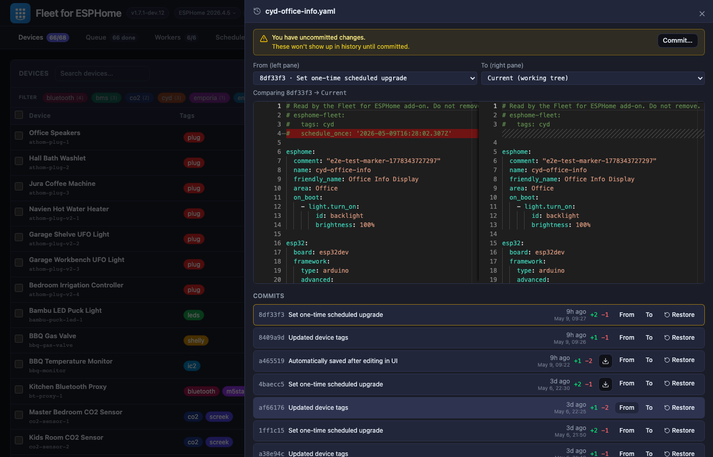

# ESPHome Fleet

[](https://opensource.org/licenses/MIT)
[](https://buymeacoffee.com/weirded)

Manage fleets of ESPHome devices from one place — bulk operations, scheduled OTA upgrades, per-device version pinning, distributed compilation, and a fast modern UI.

The stock ESPHome dashboard works fine for a handful of devices, but becomes unwieldy as your fleet grows. ESPHome Fleet adds a feature-rich management interface with bulk operations, live device logs, an inline Monaco YAML editor with schema autocomplete, scheduled upgrades, version pinning, device tags, and a distributed build system that can offload compilation to faster hardware. Even without remote workers, the built-in local worker and modern UI make this a powerful upgrade.



## How It Works

The add-on runs on your Home Assistant instance and manages everything — device discovery, the job queue, and the web UI. One or more **build workers** (lightweight Docker containers) run on any machine on your network and do the actual compiling. Workers poll for jobs, build the firmware, and push it directly to your ESP devices via OTA.

```
                              ┌──────────────┐
                         ┌───►│   Worker 1   ├───► ESP devices
  Home Assistant         │    └──────────────┘
┌──────────────────┐     │    ┌──────────────┐
│  ESPHome Fleet   ├─────┼───►│   Worker 2   ├───► ESP devices
│  (this add-on)   │     │    └──────────────┘
└──────────────────┘     │    ┌──────────────┐
                         └───►│   Worker N   ├───► ESP devices
                              └──────────────┘
```

A built-in local worker is included (starts paused). Increase its slot count in the Workers tab to start compiling immediately — no external setup required.

## Installation

### HA Add-on

[](https://my.home-assistant.io/redirect/supervisor_add_addon_repository/?repository_url=https%3A%2F%2Fgithub.com%2Fweirded%2Fdistributed-esphome)

Or manually: **Settings → Add-ons → Add-on Store → ⋮ → Repositories** → add `https://github.com/weirded/distributed-esphome`.

Then install **ESPHome Fleet** from the store.

### Standalone Server (Docker)

```bash
docker run -d \
  --name distributed-esphome-server \
  --network host \
  -v /path/to/esphome/configs:/config/esphome \
  -v esphome-dist-data:/data \
  -e SERVER_TOKEN=your-secret-token \
  ghcr.io/weirded/esphome-dist-server:latest
```

The web UI is available at `http://your-host:8765`. Use `--network host` for mDNS device discovery.

To test pre-release builds from the `develop` branch, use the `:develop` tag instead of `:latest`. The tag is updated on every push to `develop`.

## Web UI

Access via the HA sidebar (**ESPHome Fleet**) or directly at `http://your-ha-host:8765`.

- **Devices** — every ESPHome config in one place, with online status, current firmware version, and a one-click link to its Home Assistant page. Compile individual devices, everything that's outdated, or your whole fleet. Create new devices or duplicate existing ones, edit YAML inline with autocomplete and validation, pin individual devices to a specific ESPHome version, and view live device logs.
- **Queue** — live job status and build logs. Retry, cancel, or clear jobs individually or in bulk.
- **Workers** — connected build workers with their slot count, cache size, and system info. Includes a built-in local worker and a one-click setup command for adding remote workers.
- **Schedules** — every scheduled upgrade in one view. Set recurring schedules (daily, weekly, monthly, custom cron) or one-time future upgrades. Schedules are stored alongside the YAML so they travel with your config.

Dark/light theme toggle in the header.

## License

This project is licensed under the [MIT License](LICENSE).

## Support

[](https://buymeacoffee.com/weirded)
